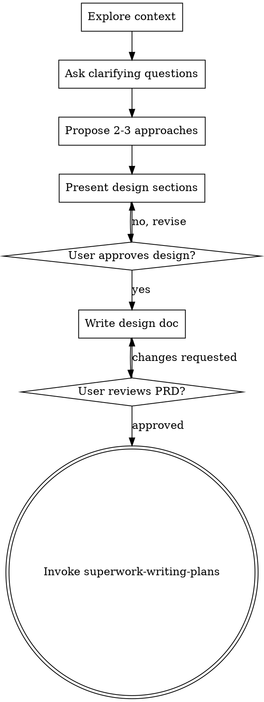

# Superwork Brainstorming

## Overview

Turn rough feature ideas into an approved, implementation-ready design before writing code.

**Core principle:** No implementation action before the design is explicit and approved.

## When to Use

Use when:
- requirements are still fuzzy
- multiple approaches are possible
- architecture or scope trade-offs are unclear
- the user asked to "think through" a feature first

Do not use when:
- the task is purely bug investigation (use `superwork-debugging`)
- the design is already approved and written (use `superwork-writing-plans`)

## Checklist

Complete these steps in order:

1. Explore project context (`.superwork/workflow.md`, related specs, relevant code)
2. Ask clarifying questions one at a time
3. Propose 2-3 approaches with trade-offs and one recommendation
4. Present the design in clear sections and collect approval
5. Write the design doc to `.superwork/prd/YYYY-MM-DD-<topic>-prd.md`
6. Self-review for ambiguity, contradictions, and missing scope boundaries
7. Ask the user to review the written PRD
8. Invoke `superwork-writing-plans`

## Process Flow

## Hard Gate

Do not invoke implementation skills, do not edit code, and do not scaffold files before design approval.

## Common Mistakes

| Mistake | Why It Fails | Correct Move |
|---|---|---|
| Jumping to code after one idea | Hidden assumptions become rework | Explore alternatives first |
| Skipping written PRD | Design gets lost between turns | Save to `.superwork/prd/...` |
| Moving ahead without user review | Plan may optimize the wrong goal | Wait for explicit approval |

## Integration

- Entry comes from `superwork-start` for design-heavy feature work
- Next step is always `superwork-writing-plans`
