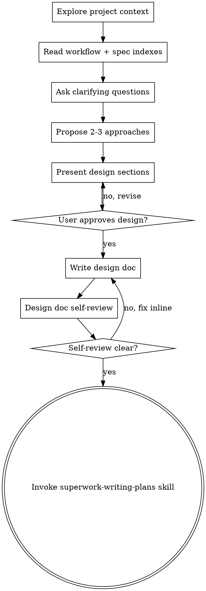

# Brainstorming Ideas Into Designs

Use this to turn broad, ambiguous, or manually selected work into a constrained design doc before planning.

Start by understanding the current project context, then ask questions one at a time to refine the idea. Once you understand what you're building, present the design and get user approval.

Artifact roles stay strict:

- `.superwork/prd/*.md` stores heavy-task design docs created here
- `.superwork/spec/**/*.md` stores durable project rules, contracts, and verification guidance
- `.superwork/plans/*.md` stores implementation plans created later by `superwork-writing-plans`

<HARD-GATE>
Do NOT invoke any implementation skill, write any code, scaffold any project, or take any implementation action until you have presented a design and the user has approved it.
</HARD-GATE>

## Checklist

You MUST create a task for each of these items and complete them in order:

1. **Explore project context** — check files, docs, recent commits
2. **Read workflow + relevant spec indexes** — read `.superwork/workflow.md`, `.superwork/spec/guides/index.md`, and the relevant `.superwork/spec/**` docs before asking detailed questions
3. **Ask clarifying questions** — one at a time, understand purpose/constraints/success criteria
4. **Propose 2-3 approaches** — with trade-offs and your recommendation
5. **Present design** — in sections scaled to their complexity, get user approval after each section
6. **Write design doc** — save to `.superwork/prd/YYYY-MM-DD-<topic>-design.md`
7. **Design doc self-review** — quick inline check for placeholders, contradictions, ambiguity, scope (see below)
8. **Finalize handoff artifact** — fix any issues inline and treat the written design doc as the planning handoff
9. **Transition to planning** — invoke `superwork-writing-plans` immediately after self-review passes to create the implementation plan

## Process Flow


```dot
digraph brainstorming {
    "Explore project context" [shape=box];
    "Read workflow + spec indexes" [shape=box];
    "Ask clarifying questions" [shape=box];
    "Propose 2-3 approaches" [shape=box];
    "Present design sections" [shape=box];
    "User approves design?" [shape=diamond];
    "Write design doc" [shape=box];
    "Design doc self-review" [shape=box];
    "Self-review clear?" [shape=diamond];
    "Invoke superwork-writing-plans skill" [shape=doublecircle];

    "Explore project context" -> "Read workflow + spec indexes";
    "Read workflow + spec indexes" -> "Ask clarifying questions";
    "Ask clarifying questions" -> "Propose 2-3 approaches";
    "Propose 2-3 approaches" -> "Present design sections";
    "Present design sections" -> "User approves design?";
    "User approves design?" -> "Present design sections" [label="no, revise"];
    "User approves design?" -> "Write design doc" [label="yes"];
    "Write design doc" -> "Design doc self-review";
    "Design doc self-review" -> "Self-review clear?";
    "Self-review clear?" -> "Write design doc" [label="no, fix inline"];
    "Self-review clear?" -> "Invoke superwork-writing-plans skill" [label="yes"];
}
```

**The terminal state is invoking `superwork-writing-plans`.** Do NOT invoke frontend-design, mcp-builder, or any other implementation skill. The ONLY skill you invoke after brainstorming is `superwork-writing-plans`.

## The Process

**Understanding the idea:**

- Check out the current project state first (files, docs, recent commits)
- You may have entered this skill because `superwork-start` auto-routed a heavy task, or because the user explicitly asked to brainstorm first. Both are valid.
- Read `.superwork/workflow.md` before deep discovery. It is the project-local source of truth for how design docs, durable specs, plans, and checks are organized.
- Read `.superwork/spec/guides/index.md` plus the relevant package/layer index docs under `.superwork/spec/**` before asking detailed questions.
- If the relevant spec files are not obvious, use the same scope-aware context loading flow as `superwork-start`: read the paths recommended by project context, then follow any linked concrete docs that define rules, contracts, or verification checklists.
- Keep a short list of the spec paths you actually read. You will write these paths into the generated design doc as recommended follow-up reading for planning and implementation.
- Before asking detailed questions, assess scope: if the request describes multiple independent subsystems (e.g., "build a platform with chat, file storage, billing, and analytics"), flag this immediately. Don't spend questions refining details of a project that needs to be decomposed first.
- If the project is too large for a single design doc, help the user decompose into sub-projects: what are the independent pieces, how do they relate, what order should they be built? Then brainstorm the first sub-project through the normal design flow. Each sub-project gets its own design doc → plan → implementation cycle.
- For appropriately-scoped projects, ask questions one at a time to refine the idea
- Prefer multiple choice questions when possible, but open-ended is fine too
- Only one question per message - if a topic needs more exploration, break it into multiple questions
- Focus on understanding: purpose, constraints, success criteria

**Exploring approaches:**

- Propose 2-3 different approaches with trade-offs
- Present options conversationally with your recommendation and reasoning
- Lead with your recommended option and explain why

**Presenting the design:**

- Once you believe you understand what you're building, present the design
- Scale each section to its complexity: a few sentences if straightforward, up to 200-300 words if nuanced
- Ask after each section whether it looks right so far
- Cover: architecture, components, data flow, error handling, testing
- Be ready to go back and clarify if something doesn't make sense

**Design for isolation and clarity:**

- Break the system into smaller units that each have one clear purpose, communicate through well-defined interfaces, and can be understood and tested independently
- For each unit, you should be able to answer: what does it do, how do you use it, and what does it depend on?
- Can someone understand what a unit does without reading its internals? Can you change the internals without breaking consumers? If not, the boundaries need work.
- Smaller, well-bounded units are also easier for you to work with - you reason better about code you can hold in context at once, and your edits are more reliable when files are focused. When a file grows large, that's often a signal that it's doing too much.

**Working in existing codebases:**

- Explore the current structure before proposing changes. Follow existing patterns.
- Where existing code has problems that affect the work (e.g., a file that's grown too large, unclear boundaries, tangled responsibilities), include targeted improvements as part of the design - the way a good developer improves code they're working in.
- Don't propose unrelated refactoring. Stay focused on what serves the current goal.

## After the Design

**Documentation:**

- Write the validated design doc to `.superwork/prd/YYYY-MM-DD-<topic>-design.md`
- Include a `Suggested Spec Reads` section near the top of the document with exact `.superwork/spec/**` paths and a one-line reason for each path
- At minimum, list `.superwork/spec/guides/index.md` plus every spec file that materially shaped the design
- Do NOT auto-commit the design doc as part of this skill

**Design Doc Header Template:**

```markdown
# [Feature Name] Design

**Goal:** [One sentence describing the design target]

**Suggested Spec Reads:**

- `.superwork/spec/guides/index.md` — shared workflow rules and project-wide checklists
- `.superwork/spec/<relevant-path>.md` — package/layer constraint that affects this design

**Context:**
[Short summary of the existing codebase or problem]

**Recommended Approach:**
[Short summary of the chosen design direction]
```

**Design Doc Self-Review:**
After writing the design doc, look at it with fresh eyes:

1. **Placeholder scan:** Any "TBD", "TODO", incomplete sections, or vague requirements? Fix them.
2. **Internal consistency:** Do any sections contradict each other? Does the architecture match the feature descriptions?
3. **Scope check:** Is this focused enough for a single implementation plan, or does it need decomposition?
4. **Ambiguity check:** Could any requirement be interpreted two different ways? If so, pick one and make it explicit.

Fix any issues inline. Re-run the checklist mentally until the written design doc is clear enough to plan from.

**Direct Handoff:**
After the self-review loop passes, do not ask the user to review the written design doc again unless they explicitly request it. The approval gate happened during the design discussion. Once the file is written and self-review is clean, proceed directly to `superwork-writing-plans`.

**Implementation:**

- Invoke the superwork-writing-plans skill to create a detailed implementation plan
- Do NOT invoke any other skill. `superwork-writing-plans` is the next step, and `superwork-executing-plans` starts only after that saved plan exists.

## Key Principles

- **One question at a time** - Don't overwhelm with multiple questions
- **Multiple choice preferred** - Easier to answer than open-ended when possible
- **YAGNI ruthlessly** - Remove unnecessary features from all designs
- **Explore alternatives** - Always propose 2-3 approaches before settling
- **Incremental validation** - Present design, get approval before moving on
- **Be flexible** - Go back and clarify when something doesn't make sense
