# Superwork Start

## Overview

Load the project's workflow and spec context before deciding how to work.

**Core principle:** Context is read from `.superwork/`, not guessed from memory.

## When to Use

Use when:
- Starting a new coding task in a `.superwork` project
- Resuming a task after time away
- Switching from one coding task to another
- Re-establishing project context before implementation

Do not use when:
- The repository does not have `.superwork/` yet
- You only need to answer a code-reading question without making changes

## Routing Decision

```dot
digraph superwork_start {
    rankdir=LR;
    "`.superwork/` exists?" [shape=diamond];
    "Use `superwork-init`" [shape=box];
    "Read workflow + context" [shape=box];
    "Bug / failing test / unexpected behavior?" [shape=diamond];
    "Needs design + planning track?" [shape=diamond];
    "Use `superwork-debugging`" [shape=box];
    "Use `superwork-brainstorming`" [shape=box];
    "Use `superwork-tdd`" [shape=box];

    "`.superwork/` exists?" -> "Use `superwork-init`" [label="no"];
    "`.superwork/` exists?" -> "Read workflow + context" [label="yes"];
    "Read workflow + context" -> "Bug / failing test / unexpected behavior?";
    "Bug / failing test / unexpected behavior?" -> "Use `superwork-debugging`" [label="yes"];
    "Bug / failing test / unexpected behavior?" -> "Needs design + planning track?" [label="no"];
    "Needs design + planning track?" -> "Use `superwork-brainstorming`" [label="yes"];
    "Needs design + planning track?" -> "Use `superwork-tdd`" [label="no"];
}
```



## Quick Reference

| Input Signal | Route |
|---|---|
| Bug report, failing test, regression, unexpected behavior | `superwork-debugging` |
| Feature request with unclear scope/architecture or multiple options | `superwork-brainstorming` |
| New feature, behavior change, enhancement, scoped refactor | `superwork-tdd` |
| `.superwork/` missing or broken | `superwork-init` first |
| Mixed or unclear task | Default to `superwork-brainstorming` first |

## Implementation

### Step 1: Verify `.superwork/`

Check whether the project has the expected runtime structure.

- If `.superwork/` is missing, stop and use `superwork-init`.
- If `.superwork/` exists but looks partial, repair it with `superwork-init` before continuing.

Do not continue normal work from a broken bootstrap.

### Step 2: Read Workflow First

Read:

```bash
cat .superwork/workflow.md
```

This is the project's local source of truth. Do not skip it because the workflow "looks familiar".

### Step 3: Load Structured Context

Run:

`<skill_dir>` means the directory containing this `SKILL.md` (skill root).

```bash
python3 <skill_dir>/scripts/get_context.py --root . --format json
```

Use the result to identify:

- project package manager
- packages and layers
- `readScope` (whether reads are narrowed by changed files)
- recommended reads
- likely test commands

If JSON output is unavailable, use the human-readable output and repair the tooling later through `superwork-init`.

### Step 4: Read the Required Indexes

At minimum, read:

- `.superwork/spec/guides/index.md`
- each path listed in `recommendedReads`

`recommendedReads` is now scope-aware by default: when changed files exist, it narrows to likely affected layers/packages; when scope cannot be inferred safely, it falls back to full indexes.

Indexes are navigation plus checklists. If an index points to concrete docs, read those docs before implementation.

### Step 5: Classify the Task

Use the user request plus current context.

Route to `superwork-debugging` when the work is primarily about:

- a bug
- a regression
- a broken test
- an unexpected runtime/build/integration failure

Route to `superwork-tdd` when the work is primarily about:

- adding behavior
- changing behavior intentionally
- implementing a feature
- planned refactoring with preserved behavior

This route means "enter the saved-plan-first TDD workflow."
It does not authorize writing a RED test or implementation directly from chat state.

Route to `superwork-brainstorming` first when feature work is non-trivial and still needs:

- requirement clarification
- architecture option comparison
- explicit design approval before coding

### Step 6: Route Automatically

Do not stop for an extra confirmation once the route is clear.

- Bug path -> use `superwork-debugging`
- Design-heavy feature path -> use `superwork-brainstorming`
- Direct feature path -> use `superwork-tdd`, then save `.superwork/plans/*.md` before any RED or implementation work

If classification is ambiguous, default to `superwork-brainstorming`.

## Common Mistakes

| Mistake | Why It Fails | Correct Move |
|---|---|---|
| Skipping `workflow.md` because the workflow is "already known" | Misses project-local differences | Read the workflow every session start |
| Reading only one index | Misses package-specific rules | Read guides plus relevant package/layer indexes |
| Routing based on file count | Scope size does not tell you bug vs feature | Route based on problem type |
| Asking for confirmation after routing | Breaks the automatic handoff design | Route directly once clear |
| Treating missing `.superwork/` as a minor issue | Every later skill depends on it | Run `superwork-init` first |
| Treating route-to-`superwork-tdd` as permission to start RED immediately | Skips the saved plan gate and breaks the workflow | Let `superwork-tdd` create the plan file first |

## Red Flags

- "I'll classify after I start coding"
- "This probably doesn't need the spec indexes"
- "The task mentions a failure, but I'll treat it as a feature to move faster"
- "The repo shape is obvious, I don't need `get_context.py`"
- "The route is clear, so I can write the failing test before the plan file exists"

All of these mean the session start is incomplete.

## Integration

- `superwork-init` is REQUIRED when `.superwork/` is missing
- `superwork-debugging` is the automatic bug path
- `superwork-brainstorming` is the design-heavy feature path
- `superwork-tdd` is the direct feature path when scope is already clear
