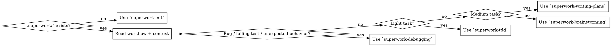

# Superwork Start

## Overview

Load project context first, then choose the shortest workflow path that still meets the quality bar.

**Core principle:** Context is read from `.superwork/`, not guessed from memory.

## When to Use

Use when:
- Starting a new coding task in a `.superwork` project
- Resuming a task after time away
- Switching from one coding task to another
- Re-establishing project context before implementation

Do not use when:
- The repository does not have `.superwork/` yet
- You only need to answer a code-reading question without making changes

## Routing Decision


```dot
digraph superwork_start {
    rankdir=LR;
    "`.superwork/` exists?" [shape=diamond];
    "Use `superwork-init`" [shape=box];
    "Read workflow + context" [shape=box];
    "Bug / failing test / unexpected behavior?" [shape=diamond];
    "Light task?" [shape=diamond];
    "Medium task?" [shape=diamond];
    "Use `superwork-debugging`" [shape=box];
    "Use `superwork-tdd`" [shape=box];
    "Use `superwork-writing-plans`" [shape=box];
    "Use `superwork-brainstorming`" [shape=box];

    "`.superwork/` exists?" -> "Use `superwork-init`" [label="no"];
    "`.superwork/` exists?" -> "Read workflow + context" [label="yes"];
    "Read workflow + context" -> "Bug / failing test / unexpected behavior?";
    "Bug / failing test / unexpected behavior?" -> "Use `superwork-debugging`" [label="yes"];
    "Bug / failing test / unexpected behavior?" -> "Light task?" [label="no"];
    "Light task?" -> "Use `superwork-tdd`" [label="yes"];
    "Light task?" -> "Medium task?" [label="no"];
    "Medium task?" -> "Use `superwork-writing-plans`" [label="yes"];
    "Medium task?" -> "Use `superwork-brainstorming`" [label="no"];
}
```

## Implementation

### Step 1: Verify `.superwork/`

Check whether the project has the expected runtime structure.

- If `.superwork/` is missing, stop and use `superwork-init`.
- If `.superwork/` exists but looks partial, repair it with `superwork-init` before continuing.

Do not continue normal work from a broken bootstrap.

### Step 2: Read Workflow First

Read:

```bash
cat .superwork/workflow.md
```

This is the project's local source of truth. Do not skip it because the workflow "looks familiar".

When the file includes tagged `superwork-route` and `superwork-state` blocks, treat those machine-readable blocks as the routing and next-step source of truth. The surrounding prose explains the same contract for humans.

### Step 3: Load Structured Context

Run:

`<skill_dir>` means the directory containing this `SKILL.md` (skill root).

```bash
python3 <skill_dir>/scripts/get_context.py --root . --format json
```

Use the result to identify:

- project package manager
- packages and layers
- `readScope` (whether reads are narrowed by changed files)
- recommended reads
- likely test commands

If JSON output is unavailable, use the human-readable output and repair the tooling later through `superwork-init`.

### Step 4: Read the Required Indexes

At minimum, read:

- `.superwork/spec/guides/index.md`
- each path listed in `recommendedReads`

`recommendedReads` is now scope-aware by default: when changed files exist, it narrows to likely affected layers/packages; when scope cannot be inferred safely, it falls back to full indexes.

Indexes are navigation plus checklists. If an index points to concrete docs, read those docs before implementation.

### Step 5: Classify the Task

Classify the task by the shortest path that still meets quality requirements.

Use the user request plus current context:

- bug, regression, broken test, or unexpected behavior -> `superwork-debugging`
- light task -> `superwork-tdd`
- medium task -> `superwork-writing-plans`
- heavy task -> `superwork-brainstorming`

Use these task-size rules for non-bug work:

- light task: single-file or small-scope change, config or copy adjustment, small test addition, or local documentation update
- medium task: clear requirements, clear boundaries, controllable multi-file change across related code, with explicit business logic or multi-component coordination
- heavy task: any other non-bug task that is not light or medium

Do not optimize for the fewest process steps. Optimize for the shortest path that still preserves quality.

`superwork-start` stops at routing. Do not pull downstream execution rules up into this skill.

### Step 6: Route Automatically

Do not stop for an extra confirmation once the route is clear.

Before entering the destination skill, explicitly output:

- the chosen route
- one short reason tied to the task classification

Use a direct format such as:

- `Routing to superwork-debugging: the request is about a failing test.`
- `Routing to superwork-tdd: this is a single-file light task.`
- `Routing to superwork-writing-plans: this is a clear multi-file medium task.`
- `Routing to superwork-brainstorming: this task is heavy and still needs design reduction.`

- Bug path -> use `superwork-debugging`
- Light task path -> use `superwork-tdd`
- Medium task path -> use `superwork-writing-plans`, then continue through `superwork-executing-plans`
- Heavy task default path -> use `superwork-brainstorming`, then continue through `superwork-writing-plans` and `superwork-executing-plans`

If the task could fit two buckets, choose the lighter one only when it still gives enough structure and verification discipline. Otherwise move up one level.

## Common Mistakes

| Mistake | Why It Fails | Correct Move |
|---|---|---|
| Skipping `workflow.md` because the workflow is "already known" | Misses project-local differences | Read the workflow every session start |
| Reading only one index | Misses package-specific rules | Read guides plus relevant package/layer indexes |
| Routing based on file count alone | File count does not tell you whether the shortest quality-preserving path is light, medium, or heavy | Classify by scope clarity, coordination needs, and risk |
| Treating every feature as brainstorming work | Heavy process on small changes slows delivery without improving quality | Send light work to `superwork-tdd` and medium work to `superwork-writing-plans` |
| Treating every clear task as light | Some clear tasks still need a saved plan because they coordinate multiple files or components | Escalate to medium when the change has real multi-step structure |
| Routing silently | The next skill handoff becomes implicit and hard to audit | State the exact route and one short reason before handoff |
| Asking for confirmation after routing | Breaks the automatic handoff design | Route directly once clear |
| Treating missing `.superwork/` as a minor issue | Every later skill depends on it | Run `superwork-init` first |
| Pulling TDD/debugging/check details into session start | Repeats downstream rules and blurs ownership | Hand off immediately after routing |

## Red Flags

- "I'll classify after I start coding"
- "This probably doesn't need the spec indexes"
- "The task mentions a failure, but I'll treat it as a feature to move faster"
- "The repo shape is obvious, I don't need `get_context.py`"
- "The route is clear, so I don't need to enter the destination skill"
- "The route is obvious, so I do not need to say it out loud"
- "Every non-bug task should go through brainstorming just to be safe"
- "This touches multiple files, but I can still force it into the light path"

All of these mean the session start is incomplete.

## Integration

- `superwork-init` is REQUIRED when `.superwork/` is missing
- `superwork-debugging` is the automatic bug path
- `superwork-tdd` is the light-task path
- `superwork-writing-plans` is the medium-task path entry
- `superwork-brainstorming` is the default heavy-task path entry, but users may invoke it manually
- branch policy stays project-local: work on the current branch unless the user explicitly says otherwise
