# Superwork TDD

## Overview

Run TDD inside the `.superwork` workflow by saving a plan first, then executing RED, GREEN, and REFACTOR from that file.

**Core principle:** If the plan is not saved or you did not watch the RED test fail, you do not have trustworthy TDD.

**Violating the letter of the rules is violating the spirit of this skill.**

## When to Use

Use when:

- Adding a new feature
- Implementing a known bugfix after `superwork-debugging` already established the root cause
- Changing behavior intentionally
- Implementing a user-facing requirement
- Refactoring while preserving or clarifying behavior

Do not use when:

- The work is still investigating a bug or failing test
- The project has not been initialized with `.superwork/`
- The change is pure formatting with no behavior impact

If the task turns into investigation, reproduction work, or root-cause hunting, stop and switch to `superwork-debugging`.

## The Iron Law

```text
NO RED WITHOUT A SAVED PLAN FILE FIRST
NO PRODUCTION CODE WITHOUT A FAILING TEST FIRST
```

Saved means a real file on disk under `.superwork/plans/`.

These do not count:

- a chat-only outline
- an inline tool plan
- a remembered step list
- "I'll save it right after the first RED test"

Write test code or production code before the plan file exists? Delete it. Start over from the saved-plan phase.

Write production code before the failing test? Delete it. Re-implement from RED.

No exceptions:

- not for "small" features
- not for "obvious" changes
- not for "just wiring"
- not by drafting production code as "reference"
- not by writing the RED test before the plan file exists
- not by keeping pre-RED code around to "adapt later"

## Quick Reference

| Phase        | Required Action                                                                    | Stop If                                                                     |
| ------------ | ---------------------------------------------------------------------------------- | --------------------------------------------------------------------------- |
| Context      | Read relevant `.superwork` indexes and rules                                       | You have not loaded the required reads                                      |
| Plan         | Save a written plan under `.superwork/plans/`                                      | You are about to write any test or implementation code without a saved plan |
| Review       | Verify the first executable task is RED                                            | The plan starts with implementation or vague tasks                          |
| Execute      | Invoke `superwork-executing-plans` with the saved plan                             | You are about to start RED from memory, chat state, or an unsaved plan      |
| RED          | Write one minimal failing test for one behavior                                    | You are bundling multiple behaviors or testing mock behavior                |
| Verify RED   | Run the targeted check and watch it fail for the expected reason                   | The test passes immediately or errors for the wrong reason                  |
| GREEN        | Implement the smallest code change that satisfies the failing test                 | You are adding options, abstractions, or unrelated cleanup                  |
| Verify GREEN | Re-run targeted and related checks until the slice is green                        | You are about to refactor or continue with failing checks                   |
| REFACTOR     | Remove duplication and improve structure only while checks stay green              | Refactor starts before green or adds new behavior                           |
| Completion   | Keep the post-green handoff in the saved plan and finish through `superwork-check` | You are about to claim completion directly                                  |

## Saved-Plan TDD Cycle

```dot
digraph superwork_tdd_cycle {
    rankdir=LR;
    context [label="Context\nLoad rules", shape=box];
    plan [label="Plan\nSave file", shape=box];
    review [label="Review\nFirst step is RED", shape=diamond];
    red [label="RED\nWrite failing test", shape=box, style=filled, fillcolor="#ffcccc"];
    verify_red [label="Verify RED\nFails correctly", shape=diamond];
    green [label="GREEN\nMinimal code", shape=box, style=filled, fillcolor="#ccffcc"];
    verify_green [label="Verify GREEN\nChecks pass", shape=diamond];
    refactor [label="REFACTOR\nClean up", shape=box, style=filled, fillcolor="#ccccff"];
    next [label="Next slice or handoff", shape=ellipse];

    context -> plan;
    plan -> review;
    review -> red [label="yes"];
    review -> plan [label="fix plan"];
    red -> verify_red;
    verify_red -> green [label="yes"];
    verify_red -> red [label="wrong failure"];
    green -> verify_green;
    verify_green -> refactor [label="yes"];
    verify_green -> green [label="no"];
    refactor -> verify_green [label="stay green"];
    verify_green -> next;
    next -> red [label="more behavior"];
}
```



## Implementation

### Step 1: Load the Relevant Rules

Before planning, read:

- `.superwork/spec/guides/index.md`
- the package/layer index files identified by `superwork-start`
- any concrete spec docs listed by those indexes

Do not rely only on memory from a prior session.

### Step 2: Create the Plan File

Save a plan file to:

`.superwork/plans/YYYY-MM-DD-<feature-name>.md`

Create the directory if it does not exist.

Until this file is saved, you are still in pre-execution.
Do not write tests, scaffolding, TODO code, or scratch implementation before the file exists on disk.

The plan should:

- contain 3-7 concrete tasks
- use checkbox tracking with `- [ ]`
- make the first executable checklist item an explicit RED test step
- separate RED, Verify RED, GREEN, and Verify GREEN into distinct checklist items
- include exact file paths and concrete commands
- include expected pass/fail signals for each verification step
- stay scoped to the current behavior slice

Reuse the `superwork-writing-plans` file format. For direct feature work, the tasks must stay TDD-shaped.

Good plan shape:

1. Add the failing test for the new behavior
2. Run it and record the expected RED signal
3. Implement the smallest code to satisfy it
4. Re-run targeted verification and record the expected green signal
5. Refine names or structure only if checks stay green
6. Run broader verification and hand off to `superwork-check`

### Step 3: Review the Plan Before Execution

Before any code change, confirm:

- the first executable task is RED, not implementation
- every GREEN step has an adjacent verification command
- no task contains placeholders, memory-only intent, or "figure it out later" wording
- the last task routes to `superwork-check`
- you have not already started RED in chat state before saving the file

If the plan fails any of these checks, fix the file first.

### Step 4: Start Execution from the Plan File

After saving the plan:

- announce the plan path
- reopen or reread the saved file
- invoke `superwork-executing-plans`
- execute from the file, not from memory and not from an inline tool plan

Do not begin RED directly in chat state before or after the plan file exists. The saved file is the execution source of truth, and RED starts only from that file.

### Step 5: RED - Write the Failing Test

Write one minimal test for one behavior.

Requirements:

- clear behavior name
- real behavior, not a mock maze
- minimal setup
- failure proves the feature is missing or wrong

If the test name contains multiple behaviors or relies mainly on mock call counts, split or redesign it first.

### Step 6: Verify RED - Watch It Fail

Run the targeted test command and confirm:

- it fails
- it fails for the expected reason
- it is not a typo, import, or environment failure

If it passes immediately, you are testing existing behavior. Fix the test.

If it errors instead of failing, fix the test or setup and re-run until the failure proves the behavior is missing.

If the failure reason is unclear, nondeterministic, or points to an unknown regression, stop and switch to `superwork-debugging`.

### Step 7: GREEN - Write Minimal Code

Write the smallest implementation that satisfies the failing test.

Do not:

- add extra options "for future use"
- refactor unrelated code
- widen scope because "you're already here"

If you need a second behavior, finish the first cycle first.

If production code already exists from before RED, delete or discard it and implement fresh from the failing test.

### Step 8: Verify GREEN - Watch It Pass

Run the targeted test again.

Confirm:

- the RED test now passes
- related tests still pass
- the output is clean enough to trust

If other tests fail, fix them before continuing.

Do not refactor, broaden scope, or claim progress while the current slice is not green.

### Step 9: REFACTOR Carefully

Only after green:

- remove duplication
- improve names
- extract helpers
- simplify structure

Every refactor must keep tests green. Re-run the relevant checks after each meaningful cleanup.

### Step 10: Repeat or Switch

If more behavior remains, start a fresh RED cycle.

Add the next behavior as a new checked task sequence in the same plan file or a follow-up plan file, then continue through `superwork-executing-plans`.

Switch to `superwork-debugging` instead when:

- a regression or environment issue appears that the current test does not explain
- the failing condition is flaky or hard to reproduce
- you cannot state the root cause of a required fix

### Step 11: Handoff Through `superwork-check`

When the requested behavior is complete, follow the saved plan's post-green handoff and route to `superwork-check`.

`superwork-check` owns the exact `superwork-code-simplifier` and `superwork-update-spec` rules.

Do not declare the work complete before the check stage.

## Why Order Matters

- Tests written after code answer "what did I build" instead of "what should this do"
- Manual testing is ad-hoc and cannot be replayed reliably during later changes
- Pre-RED scaffolding biases the implementation and hides missing edge cases
- If a test never failed for the expected reason, it has not proved anything yet

## Common Rationalizations

| Excuse                                                           | Reality                                                           |
| ---------------------------------------------------------------- | ----------------------------------------------------------------- |
| "This is too small for TDD"                                      | Small changes still regress behavior                              |
| "I'll write tests after the code"                                | Tests-after cannot prove the test catches the change              |
| "Tests after achieve the same goal"                              | Tests-after are biased by the implementation you already chose    |
| "The API is obvious, I'll just scaffold first"                   | Scaffolding production code before RED is still a violation       |
| "I already manually tested it"                                   | Manual testing is not repeatable evidence                         |
| "I already know which files to edit"                             | Knowing the file is not the same as proving the behavior          |
| "The plan can stay in my head"                                   | Hidden plans drift immediately                                    |
| "The inline tool plan is enough"                                 | The executable source of truth must be the saved plan file        |
| "I'll save the plan later after the first test"                  | That still starts execution without the required written workflow |
| "I'll just write the failing test first, then document the plan" | RED is execution and cannot start before the saved file exists    |
| "I can keep the existing code as reference"                      | You will adapt it. Delete means delete                            |
| "Deleting the first attempt wastes time"                         | Keeping untrusted code wastes more time later                     |
| "This is different because I already understand the fix"         | Understanding the fix does not replace proof                      |

## Verification Checklist

Before handing off to `superwork-check`:

- [ ] The plan file exists under `.superwork/plans/`
- [ ] The first executable checklist item in that file was RED
- [ ] Each RED test failed for the expected reason before implementation
- [ ] Each GREEN step was followed by targeted verification
- [ ] No production code from before RED was kept for adaptation
- [ ] Refactors happened only after the slice was green
- [ ] The saved plan still contains the post-green handoff to `superwork-check`

Cannot check every box? The TDD cycle is incomplete.

## Red Flags

- writing production code before the saved plan file exists
- writing test code before the saved plan file exists
- starting execution from memory instead of reopening the saved plan
- a plan whose first executable task is implementation, not RED
- writing production code before the failing test
- keeping pre-RED code around as "reference"
- a test that passes on first run
- a test that errors and you continue anyway
- not being able to explain why the test failed
- adding options, flags, or abstractions not required by the current test
- saying "I already manually tested it"
- saying "done" before `superwork-check`

If any of these happen, stop, discard the invalid slice, and return to the correct phase.

## When Stuck

| Problem                             | Correct Move                                                                       |
| ----------------------------------- | ---------------------------------------------------------------------------------- |
| Do not know how to start the test   | Write the wished-for behavior first, then assert the smallest visible outcome      |
| The test needs too much setup       | Simplify the interface or slice; large setup usually means the design is too broad |
| You must mock everything            | Prefer real behavior; if coupling is too high, simplify the design first           |
| The failure is flaky or unexplained | Switch to `superwork-debugging` and reproduce the issue cleanly                    |

## Integration

- `superwork-start` should have already loaded the correct context
- `superwork-writing-plans` provides the canonical file format for the saved plan
- `superwork-executing-plans` is REQUIRED after saving the plan file
- known bugfixes should usually enter here only after `superwork-debugging` established the root cause and failing reproduction
- `superwork-check` owns completion verification, `superwork-code-simplifier` enforcement, and the `superwork-update-spec` decision
