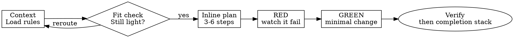

# Superwork TDD

## Overview

Use this as the light-task path: load the rules, write a short inline TDD plan, then execute it step by step in the same session without creating a saved plan document.

**Core principle:** For light tasks, the disciplined path is an inline TDD plan plus real RED/GREEN verification, not a heavyweight plan artifact.

**Violating the letter of the rules is violating the spirit of this skill.**

## When to Use

Use when:

- Making a single-file or small-scope code change
- Adjusting config or user-facing copy in a bounded area
- Adding or updating a small test in support of a light change
- Updating local documentation that belongs to a small implementation slice
- Delivering a scoped behavior change that does not need cross-file execution planning

Do not use when:

- The work is still investigating a bug or failing test
- The task needs a saved execution artifact across multiple related files
- The task is large, cross-cutting, or still needs design reduction
- The project has not been initialized with `.superwork/`
- The change is pure formatting with no behavior impact

If the task stops being light, reroute immediately:

- medium task -> `superwork-writing-plans`, then `superwork-executing-plans`
- heavy task -> `superwork-brainstorming`, then `superwork-writing-plans`, then `superwork-executing-plans`
- investigation or root-cause hunting -> `superwork-debugging`

## The Iron Law

```text
NO LIGHT-TASK EXECUTION WITHOUT AN INLINE TDD PLAN FIRST
NO PRODUCTION CODE WITHOUT A FAILING TEST FIRST
```

Inline means a real step list in the active session or task tracker.

These do not count:

- a remembered step list
- "I'll just keep the plan in my head"
- jumping from context loading straight to code
- creating a heavyweight `.superwork/plans/*.md` file just to satisfy process on a light task

Write test code or production code before the inline plan exists? Delete it. Start over from the inline-planning phase.

Write production code before the failing test? Delete it. Re-implement from RED.

No exceptions:

- not for "obvious" changes
- not for "just wiring"
- not by drafting production code as "reference"
- not by skipping the inline plan because the task feels tiny
- not by creating a saved plan document when the work is still light
- not by keeping pre-RED code around to "adapt later"

## Quick Reference

| Phase | Required Action | Stop If |
|---|---|---|
| Context | Read relevant `.superwork` indexes and rules | You have not loaded the required reads |
| Fit Check | Confirm the work is still light | The task now needs cross-file planning or design |
| Inline Plan | Write a short TDD step list in-session | You are about to code from memory with no explicit steps |
| RED | Write and run the smallest failing test or equivalent proof | The failure never happened for the intended reason |
| GREEN | Implement the minimum change to make RED pass | You are broadening scope or adding speculative structure |
| Verify | Re-run the targeted checks and route to completion | You are about to call the task done without fresh evidence |

## Inline TDD Cycle



## Implementation

### Step 1: Load the Relevant Rules

Before planning, read:

- `.superwork/spec/guides/index.md`
- the package/layer index files identified by `superwork-start`
- any concrete spec docs listed by those indexes

Do not rely only on memory from a prior session.

### Step 2: Confirm the Task Is Still Light

Light task signals include:

- one file or a tightly bounded local area
- configuration or copy changes with obvious blast radius
- a small test addition or update
- a local documentation change tied to one implementation slice

Escalate instead when any of these appear:

- multiple related files that need coordination
- explicit business logic across components
- architecture or product-shape questions
- the smallest quality-preserving path now needs a saved plan or design document

### Step 3: Write the Inline TDD Plan

Write a short execution plan in-session before RED.

Keep it short and concrete:

- 3-6 steps
- each step is one action
- include RED, fail verification, GREEN, pass verification, and completion handoff
- use TodoWrite or an equivalent visible checklist when helpful

Do not create `.superwork/plans/*.md` for a task that still fits the light path.

### Step 4: Execute the Plan Step by Step

Execute from the inline step list, not from memory.

- Write the failing test first.
- Run it and confirm it fails for the intended reason.
- Implement the smallest change that makes it pass.
- Re-run the targeted verification.
- Keep the scope inside the original light-task boundary.

For local docs or copy-only tasks, replace the failing test with the smallest falsifiable proof available, such as a focused render, lint, build, snapshot, or search-based check. The point is still to prove the change before and after editing.

### Step 5: Route Completion Through the Superwork Stack

After GREEN and targeted verification:

- make the `superwork-code-simplifier` decision explicit
- run `superwork-code-simplifier` when the diff is medium or large, or when cleanup is still needed
- otherwise state why the diff is truly small
- enter `superwork-check`

## Why Order Matters

- Tests written after code answer "what did I build" instead of "what should this do"
- Even light tasks drift when the steps stay implicit
- Manual testing is ad-hoc and cannot be replayed reliably during later changes
- If a test or equivalent proof never failed for the expected reason, it has not proved anything yet

## Common Rationalizations

| Excuse                                                           | Reality                                                           |
| ---------------------------------------------------------------- | ----------------------------------------------------------------- |
| "This is too small for TDD"                                      | Small changes still regress behavior                              |
| "This is too small for an inline plan"                           | Hidden steps drift even faster on small changes                   |
| "I'll write tests after the code"                                | Tests-after cannot prove the test catches the change              |
| "Tests after achieve the same goal"                              | Tests-after are biased by the implementation you already chose    |
| "The API is obvious, I'll just scaffold first"                   | Scaffolding production code before RED is still a violation       |
| "I already manually tested it"                                   | Manual testing is not repeatable evidence                         |
| "I already know which files to edit"                             | Knowing the file is not the same as proving the behavior          |
| "The plan can stay in my head"                                   | Hidden plans drift immediately                                    |
| "I'll write a full plan doc to be safe"                          | Light tasks should use the shortest quality-preserving path       |
| "This grew a bit, but I'll keep it light to move faster"         | Once the task needs more structure, reroute                       |
| "I can keep the existing code as reference"                      | You will adapt it. Delete means delete                            |
| "Deleting the first attempt wastes time"                         | Keeping untrusted code wastes more time later                     |
| "This is different because I already understand the fix"         | Understanding the fix does not replace proof                      |

## Verification Checklist

Before handing off to `superwork-check`:

- [ ] The task still fit the light-task definition when execution started
- [ ] An inline TDD plan existed before RED
- [ ] The first executable step was RED or an equivalent falsifiable proof
- [ ] The targeted verification failed first for the expected reason
- [ ] The implementation stayed within the original light-task boundary
- [ ] No production code from before RED was kept for adaptation
- [ ] Completion routed through `superwork-code-simplifier` decision and `superwork-check`

Cannot check every box? The TDD cycle is incomplete.

## Red Flags

- writing production code before the inline plan exists
- writing test code before the inline plan exists
- skipping the inline plan and doing RED/GREEN from memory
- creating a saved plan doc for a task that is still clearly light
- a first executable step that is implementation, not RED
- writing production code before the failing test
- keeping pre-RED code around as "reference"
- adding options, flags, or abstractions not required by the current test
- saying "I already manually tested it"
- quietly letting a light task sprawl into medium territory
- saying "done" before `superwork-check`

If any of these happen, stop, discard the invalid slice, and return to the correct phase.

## When Stuck

| Problem | Correct Move |
|---|---|
| Do not know how to start the test | Write the wished-for behavior first, then assert the smallest visible outcome |
| The test needs too much setup | The task is probably not light anymore; reroute to `superwork-writing-plans` |
| You must touch several related files | Escalate to the medium path before continuing |
| You must compare multiple architecture options | Escalate to `superwork-brainstorming` |
| The failure is flaky or unexplained | Switch to `superwork-debugging` and reproduce the issue cleanly |

## Integration

- `superwork-start` should have already loaded the correct context
- `superwork-writing-plans` and `superwork-executing-plans` own the medium-task path, not this skill
- `superwork-brainstorming` is the default heavy-task path before planning and remains available for manual design work
- `superwork-check` owns completion verification, `superwork-code-simplifier` enforcement, and the `superwork-update-spec` decision
